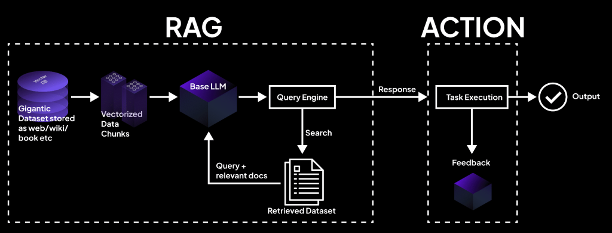

# 🔍 RAG Manifestosu

Retrieval-Augmented Generation (RAG) için 100'den fazla kütüphane, çerçeve ve aracın yer aldığı kapsamlı bir depodur. Çeşitli RAG çözümlerini keşfetmek ve uygulamak isteyen araştırmacılar, geliştiriciler ve yapay zeka meraklıları için tasarlanmıştır. Amacımız, hızla gelişen RAG teknolojileri dünyasında gezinmenize yardımcı olacak açık rehberlik ve düzenli bir kaynak sağlamaktır.

  

  
   
  <em>Şekil 1: Bir RAG sistem mimarisi diyagramına örnek.</em>

---

Aşağıdaki hızlı bağlantıları kullanarak depodaki belirli kategorilere geçiş yapabilirsiniz:

## Hızlı Bağlantılar
||||  
|---|---|---|  
| [🏗️ RAG Çerçeveleri](#rag-%C3%A7er%C3%A7eveleri) | [📚 Belge İşleme](#belge-i%C5%9Fleme) | [🔎 Vektör Veritabanları](#vekt%C3%B6r-veritabanlar%C4%B1) |  
| [🧠 Embedding Modelleri](#embedding-modelleri) | [🔄 Chunking Stratejileri](#chunking-stratejileri) | [📊 Bilgi Çekme Yöntemleri](#bilgi-%C3%A7ekme-y%C3%B6ntemleri) |  
| [🤖 Gelişmiş RAG Mimarileri](#geli%C5%9Fmi%C5%9F-rag-mimarileri) | [🧪 Değerlendirme ve Test](#de%C4%9Ferlendirme-ve-test) | [📈 RAG Optimizasyonu](#rag-optimizasyonu) |  
| [🔧 RAG Araçları](#rag-araclar%C4%B1) | [📝 Sorgu Dönüşümü](#sorgu-d%C3%B6n%C3%BC%C5%9F%C3%BC) | [🧩 Çok Modlu RAG](#%C3%A7ok-modlu-rag) |  
| [🚀 Üretim ve Dağıtım](#%C3%BCretim-ve-da%C4%9F%C4%B1t%C4%B1m) | [🔐 Güvenlik ve Uyum](#g%C3%BCvenlik-ve-uyum) | [📖 Öğrenme Kaynakları](#%C3%B6%C4%9Frenme-kaynaklar%C4%B1) |

## RAG Çerçeveleri
RAG Çerçeveleri, retrieval-augmented generation uygulamaları oluşturmak için temel yapı taşlarını sağlar. Belgelerin yüklenmesi, bilgi çekme ve dil üretimi süreçlerini kolaylaştırarak, ölçeklenebilir ve modüler yapay zeka sistemleri için idealdir.

| Kütüphane | Açıklama | Bağlantı |
|-----------|----------|----------|
| LangChain | Belge yükleyiciler, bilgi çekiciler ve ajanlarla RAG uygulamaları geliştirmek için önde gelen çerçeve | [Bağlantı](https://github.com/langchain-ai/langchain) |
| LlamaIndex | Özel veri kaynaklarını LLM'lere bağlamayı kolaylaştıran yaygın olarak kullanılan veri çerçevesi | [Bağlantı](https://github.com/run-llama/llama_index) |
| Haystack | Kapsamlı RAG işlevselliği ve boru hattı mimarisi ile uçtan uca NLP çerçevesi | [Bağlantı](https://github.com/deepset-ai/haystack) |
| DSPy | Stanford NLP'nin, dil modelleri için deklaratif API sunan çerçevesi | [Bağlantı](https://github.com/stanfordnlp/dspy) |
| Llmware | Uzman modeller için üretime hazır özelliklere sahip kurumsal RAG çerçevesi | [Bağlantı](https://github.com/llmware-ai/llmware) |
| Embedchain | Herhangi bir veri kaynağından minimum kurulumla botlar oluşturmak için açık kaynaklı RAG çerçevesi | [Bağlantı](https://github.com/embedchain/embedchain) |
| AutoChain | Yapılandırılmış çıktılarla güvenilir LLM uygulamaları oluşturmak ve çalıştırmak için çerçeve | [Bağlantı](https://github.com/Forethought-Technologies/AutoChain) |
| Langflow | RAG uygulamalarını hızlıca oluşturmak ve prototiplemek için görsel düşük kodlu araç | [Bağlantı](https://github.com/langflow-ai/langflow) |
| CrewAI | Karmaşık RAG iş akışlarında rol oynayan ajanları koordine etmek için çerçeve | [Bağlantı](https://github.com/joaomdmoura/crewAI) |
| FastRAG | Verimli ve optimize edilmiş RAG boru hatları için Intel'in araştırma çerçevesi | [Bağlantı](https://github.com/IntelLabs/fastRAG) |

## Belge İşleme
Belge İşleme kütüphaneleri, yapılandırılmamış verileri daha kolay analiz edilebilen yapılandırılmış formatlara dönüştürmeye odaklanır. Çeşitli dosya türleri ve veri kaynakları ile çalışırken güçlü ön işleme yetenekleri sunar.

| Kütüphane | Açıklama | Bağlantı |
|-----------|----------|----------|
| Unstructured | Yapılandırılmamış verilerden bilgi çıkarmak ve ön işleme yapmak için önde gelen kütüphane | [Bağlantı](https://github.com/Unstructured-IO/unstructured) |
| LangChain Document Loaders | Çeşitli dosya türleri ve veri kaynakları için kapsamlı belge yükleyici koleksiyonu | [Bağlantı](https://python.langchain.com/docs/integrations/document_loaders/) |
| DocArray | İç içe geçmiş çok modlu veriyi temsil etmek, göndermek ve depolamak için güçlü kütüphane | [Bağlantı](https://github.com/docarray/docarray) |
| PyMuPDF | LLM & RAG ortamları için PDF içeriğini çıkarmada endüstri standardı kütüphane | [Bağlantı](https://pymupdf.readthedocs.io/en/latest/) |
| LlamaHub | 100'den fazla veri kaynağı için geniş veri yükleyici ve okuyucu koleksiyonu | [Bağlantı](https://github.com/run-llama/llama-hub) |
| Txtai | Belge işleme yeteneklerine sahip, hepsi bir arada gömme veritabanı | [Bağlantı](https://github.com/neuml/txtai) |
| Chroma | Güçlü belge işlemcilerine sahip açık kaynaklı gömme veritabanı | [Bağlantı](https://github.com/chroma-core/chroma) |
| Semantic Router | Akıllı belge yönlendirme ve işleme sistemi | [Bağlantı](https://github.com/aurelio-labs/semantic-router) |
| Detectron2 | Facebook AI'nin gelişmiş belge düzen analizi sistemi | [Bağlantı](https://github.com/facebookresearch/detectron2) |
| Document Understanding | Microsoft'un kapsamlı belge işleme araç seti | [Bağlantı](https://github.com/microsoft/unilm/tree/master/dit) |

## Vektör Veritabanları
Vektör Veritabanları, gömme (embedding) gibi yüksek boyutlu vektörlerin saklanması ve aranması için tasarlanmıştır. Hızlı benzerlik aramalarını mümkün kılar ve büyük ölçekli veri çekme ve öneri sistemleri için kritik öneme sahiptir.

| Kütüphane | Açıklama | Bağlantı |
|-----------|----------|----------|
| Faiss | Meta'nın, büyük çapta benimsenen verimli benzerlik araması için endüstri standardı kütüphanesi | [Bağlantı](https://github.com/facebookresearch/faiss) |
| Milvus | Ölçeklenebilir benzerlik araması için kurumsal düzeyde geliştirilmiş vektör veritabanı | [Bağlantı](https://github.com/milvus-io/milvus) |
| Pinecone | Üretim amaçlı yapay zeka uygulamaları için önde gelen sunucusuz vektör veritabanı | [Bağlantı](https://www.pinecone.io/) |
| Weaviate | Entegre nöral arama yeteneklerine sahip açık kaynaklı vektör veritabanı | [Bağlantı](https://github.com/weaviate/weaviate) |
| Qdrant | Genişletilmiş filtreleme özelliklerine sahip yüksek performanslı vektör benzerlik arama motoru | [Bağlantı](https://github.com/qdrant/qdrant) |
| Chroma | RAG uygulamaları için özel olarak geliştirilmiş, geliştirici dostu gömme veritabanı | [Bağlantı](https://github.com/chroma-core/chroma) |
| PGVector | SQL entegrasyonu ile vektör benzerlik araması için PostgreSQL eklentisi | [Bağlantı](https://github.com/pgvector/pgvector) |
| Vespa | Büyük vektör veri setleri üzerinde düşük gecikmeli hesaplama için ölçeklenebilir motor | [Bağlantı](https://github.com/vespa-engine/vespa) |
| LanceDB | Makine öğrenimi uygulamaları için hızlı yerel işlem yapabilen vektör veritabanı | [Bağlantı](https://github.com/lancedb/lancedb) |
| Elasticsearch | Vektör arama yeteneklerine sahip kurumsal arama platformu | [Bağlantı](https://github.com/elastic/elasticsearch) |

## Embedding Modelleri
Embedding Modelleri, ham verileri anlamsal içerik taşıyan yoğun vektör temsillerine dönüştürür. Semantik arama, öneri sistemleri ve bilgi çekme doğruluğunu artırma gibi görevler için temel öneme sahiptir.

| Kütüphane | Açıklama | Bağlantı |
|-----------|----------|----------|
| Sentence-Transformers | Son teknoloji metin gömme için Python çerçevesi | [Bağlantı](https://github.com/UKPLab/sentence-transformers) |
| Text Embedding Inference | Metin gömme modelleri için hızlı çıkarım çözümü | [Bağlantı](https://github.com/huggingface/text-embeddings-inference) |
| E5 | Bilgi çekme görevleri için optimize edilmiş metin gömmeleri | [Bağlantı](https://huggingface.co/intfloat/e5-base-v2) |
| GTE | Alibaba DAMO Academy tarafından geliştirilen Genel Metin Gömmeleri | [Bağlantı](https://huggingface.co/Alibaba-NLP/gte-base) |
| BAAI Embeddings | Çeşitli bilgi çekme görevleri için optimize edilmiş açık kaynaklı gömmeler | [Bağlantı](https://huggingface.co/BAAI/bge-large-en-v1.5) |
| Instructor | Farklı kullanım senaryoları için belirli talimatlarla gömme hesaplama | [Bağlantı](https://github.com/HKUNLP/instructor-embedding) |
| OpenAI Embeddings | OpenAI'nin text-embedding-3-large gibi modellerinden gömmeler | [Bağlantı](https://platform.openai.com/docs/guides/embeddings) |
| Cohere Embeddings | RAG uygulamaları için optimize edilmiş metin gömmeleri | [Bağlantı](https://cohere.com/embeddings) |
| Nomic Embeddings | Kurumsal veriler için optimize edilmiş açık kaynaklı metin gömmeleri | [Bağlantı](https://github.com/nomic-ai/nomic-embed-text) |
| LangChain Embeddings | Çeşitli gömme modellerine arayüz sağlayan yapı | [Bağlantı](https://python.langchain.com/docs/modules/data_connection/text_embedding/) |

## Chunking Stratejileri
Chunking Stratejileri, uzun belgeleri daha küçük, anlamlı parçalara ayırır. Bu yaklaşım, işleme sırasında bağlamın korunmasını sağlar ve uzun metinlerin verimli bir şekilde ele alınmasına yardımcı olur.

| Kütüphane | Açıklama | Bağlantı |
|-----------|----------|----------|
| Chonkie | Hafif, çok hızlı ve kullanımı kolay RAG chunking kütüphanesi | [Bağlantı](https://github.com/chonkie-ai/chonkie) |
| LlamaIndex Chunking | Çeşitli chunking stratejilerine sahip metin bölenler | [Bağlantı](https://docs.llamaindex.ai/en/stable/module_guides/loading/node_parsers/) |
| LangChain Text Splitters | Özyinelemeli, anlamsal ve token tabanlı gibi chunking yöntemlerinin koleksiyonu | [Bağlantı](https://python.langchain.com/docs/modules/data_connection/document_transformers/) |
| Haystack Preprocessors | Metin ön işleme ve chunking bileşenleri | [Bağlantı](https://docs.haystack.deepset.ai/docs/preprocessor) |
| Text Splitter Collection | Farklı metin bölme stratejilerine adanmış kütüphane | [Bağlantı](https://github.com/langchain-ai/text-splitter) |
| Adaptive Chunking | Belge yapısına uyum sağlayan gelişmiş chunking stratejileri | [Bağlantı](https://github.com/AkshitIreddy/Adaptive-RAG-Methods) |
| Semantic Chunking | Anlamsal olarak uyumlu parçalar oluşturmak için araç | [Bağlantı](https://github.com/Canner/semantic-chunking) |
| TextMesh | Çeşitli sınırlara dayalı RAG chunking için araç seti | [Bağlantı](https://github.com/akdavid1/textmesh) |
| ChunkViz | Belge chunking stratejilerini görselleştiren araç | [Bağlantı](https://github.com/FullStackRetrieval-com/chunkviz) |
| Split by Header | Hiyerarşik yapıya sahip belgeler için özel bölme aracı | [Bağlantı](https://github.com/llamahub/split-by-header) |

## Bilgi Çekme Yöntemleri
Bilgi Çekme Yöntemleri, büyük veri setlerinden en alakalı bilgileri hızlıca çekmek için geliştirilmiş teknikler ve algoritmaları içerir. RAG sistemlerinde bilgi çekme doğruluğunu ve verimliliğini artırmada hayati öneme sahiptir.

| Kütüphane | Açıklama | Bağlantı |
|-----------|----------|----------|
| Rerankers | Çeşitli yeniden sıralama modelleri için hafif, birleşik API | [Bağlantı](https://github.com/AnswerDotAI/rerankers) |
| ColBERT | Geç etkileşimle çalışan son teknoloji nöral arama | [Bağlantı](https://github.com/stanford-futuredata/ColBERT) |
| TART | Gelişmiş bilgi çekme teknikleri için araç seti | [Bağlantı](https://github.com/facebookresearch/tart) |
| SBERT Reranker | Arama sonuçlarını yeniden sıralamak için çift yönlü çapraz kodlayıcı | [Bağlantı](https://www.sbert.net/examples/applications/cross-encoder/README.html) |
| Hydra | Toplu yöntemlerle bilgi çekme için çok başlı yaklaşım | [Bağlantı](https://github.com/primeqa/primeqa) |
| DeepImpact | Yoğun bilgi çekme için derin belge etkisini öğrenme | [Bağlantı](https://github.com/AmenRa/retriv) |
| SPLADE | Bilgi çekme için seyrek leksikal ve genişleme modeli | [Bağlantı](https://github.com/naver/splade) |
| HyDE | Geliştirilmiş bilgi çekme için varsayımsal belge gömmeleri | [Bağlantı](https://github.com/texttron/hyde) |
| RAGatouille | RAG için gelişmiş bilgi çekme yöntemlerini içeren koleksiyon | [Bağlantı](https://github.com/bclavie/RAGatouille) |
| Parent Document Retriever | Uzun belgeler için hiyerarşik bilgi çekme yöntemi | [Bağlantı](https://github.com/langchain-ai/langchain/blob/master/libs/langchain/langchain/retrievers/parent_document_retriever.py) |

## Gelişmiş RAG Mimarileri
Gelişmiş RAG Mimarileri, retrieval-augmented generation sistemlerine karmaşık muhakeme, bellek mekanizmaları ve çok adımlı işlem katmanları ekler. Derin bağlam anlayışı ve dinamik, çok yönlü yanıtlar gerektiren sofistike uygulamalar için tasarlanmıştır.

| Kütüphane | Açıklama | Bağlantı |
|-----------|----------|----------|
| Agentic RAG | Vectara ile ajans benzeri RAG uygulamaları geliştirmek için çerçeve | [Bağlantı](https://vectara.github.io/py-vectara-agentic/latest/) |
| GraphRAG | Karmaşık muhakeme için grafik tabanlı RAG uygulaması | [Bağlantı](https://github.com/langchain-ai/langgraph) |
| Self-RAG | Kendi kendini yansıtan retrieval-augmented generation | [Bağlantı](https://github.com/AkariAsai/self-rag) |
| RAPTOR | Ağaç düzenli bilgi çekme için özyinelemeli özet işleme | [Bağlantı](https://github.com/McGill-NLP/RAPTOR) |
| FLARE | İleriye dönük aktif bilgi çekme destekli üretim | [Bağlantı](https://github.com/jzbjyb/FLARE) |
| CRAG | Uzun konuşmalar için bellekli bağlamsal RAG | [Bağlantı](https://github.com/predibase/crag) |
| Adaptive RAG | Sorgu karmaşıklığına dinamik olarak uyum sağlayan RAG sistemleri | [Bağlantı](https://github.com/FullStackRetrieval-com/adaptive-rag) |
| RecurrentRAG | RAG'de yinelemeli bellek mekanizmalarının uygulanması | [Bağlantı](https://github.com/IntelLabs/fastRAG) |
| KATE | RAG için bilgi-adaptif metin çıkarımı | [Bağlantı](https://github.com/neulab/kate) |
| IRAG | Kendi kendini yansıtan ve öğrenen, bağlam içinde RAG | [Bağlantı](https://github.com/wangyuxi96/IRAG) |

## Değerlendirme ve Test
Değerlendirme ve Test araçları, RAG sistemlerinin güvenilirliğini ve performansını sağlamak için ölçütler, metrikler ve izleme yetenekleri sunar. Çıktıları doğrulamak ve sürekli iyileştirmeleri yönlendirmek için gereklidir.

| Kütüphane | Açıklama | Bağlantı |
|-----------|----------|----------|
| Ragas | 3.5k+ yıldızla RAG sistemleri için kapsamlı değerlendirme çerçevesi | [Bağlantı](https://github.com/explodinggradients/ragas) |
| TruLens | 1.7k+ yıldızla LLM uygulamaları için popüler değerlendirme ve gözlemlenebilirlik aracı | [Bağlantı](https://github.com/truera/trulens) |
| LangChain Evaluation | RAG boru hatları için resmi LangChain değerlendirme çerçevesi | [Bağlantı](https://python.langchain.com/docs/guides/evaluation/) |
| DeepEval | 1.4k+ yıldızla endüstri standardı LLM değerlendirme çerçevesi | [Bağlantı](https://github.com/confident-ai/deepeval) |
| BEIR | 800+ yıldızla bilgi çekme için yaygın kullanılan benchmark | [Bağlantı](https://github.com/beir-cellar/beir) |
| LangSmith | 1k+ yıldızla LangChain tarafından üretime hazır değerlendirme platformu | [Bağlantı](https://github.com/langchain-ai/langsmith-sdk) |
| Prometheus | 1.2k+ yıldızla Stanford CRFM'in jeneratif AI için değerlendirme çerçevesi | [Bağlantı](https://github.com/stanford-crfm/prometheus) |
| MLflow Evaluation | Popüler MLflow platformunda değerlendirme yetenekleri | [Bağlantı](https://mlflow.org/docs/latest/llms/llm-evaluate/index.html) |
| Giskard | 3k+ yıldızla açık kaynak LLM test çerçevesi | [Bağlantı](https://github.com/Giskard-AI/giskard) |
| Promptfoo | 4.6k+ yıldızla popüler LLM prompt test aracı | [Bağlantı](https://github.com/promptfoo/promptfoo) |

## RAG Optimizasyonu
RAG Optimizasyonu araçları, gecikmeyi azaltarak ve kaynak verimliliğini artırarak sistem performansını iyileştirmeyi amaçlar. Prompt sıkıştırma, anlamsal önbellekleme ve paralel işleme gibi teknikler hesaplama maliyetlerini düşürmede yardımcı olur.

| Kütüphane | Açıklama | Bağlantı |
|-----------|----------|----------|
| LLMLingua | RAG performansını hızlandırmak için promptları sıkıştıran kütüphane | [Bağlantı](https://github.com/microsoft/LLMLingua) |
| Selective Context | LLM'lerin 2 kat daha fazla içeriği işleyebilmesi için prompt ve bağlamı sıkıştırır | [Bağlantı](https://pypi.org/project/selective-context/) |
| GPTCache | LLM sorguları için anlamsal önbellek oluşturma kütüphanesi | [Bağlantı](https://github.com/zilliztech/gptcache) |
| PCToolkit | Plug-and-play prompt sıkıştırma araç seti | [Bağlantı](https://github.com/3DAgentWorld/Toolkit-for-Prompt-Compression) |
| FastRAG | RAG optimizasyonuna odaklanan çerçeve | [Bağlantı](https://github.com/IntelLabs/fastRAG) |
| ThreadSplit | RAG için çoklu iş parçacığı ile paralel chunking ve işleme | [Bağlantı](https://github.com/mcmonkeyprojects/threadedchunking) |
| RAGFlow | RAG mimarileri için uçtan uca optimizasyon boru hattı | [Bağlantı](https://github.com/CarperAI/RAGFlow) |
| Semantic Router | Sorguları uygun RAG bileşenlerine yönlendirmeyi optimize eden araç | [Bağlantı](https://github.com/aurelio-labs/semantic-router) |
| Token Tunnel | Token sınırları dahilinde bağlamı maksimize etmek için optimizasyon tekniği | [Bağlantı](https://github.com/hwchase17/token-tunnel) |
| Distill-Embed | Bilgi çekme performansını optimize etmek için gömme damıtma yöntemi | [Bağlantı](https://github.com/embeddings-benchmark/mteb) |

## RAG Araçları
RAG Araçları, RAG uygulamalarının geliştirilmesini, görselleştirilmesini ve dağıtılmasını kolaylaştıran yardımcı araçlar sunar. Kullanıcı dostu arayüzler ve entegrasyon yetenekleri ile yapılandırma ve bakım süreçlerinde verimliliği artırır.

| Kütüphane | Açıklama | Bağlantı |
|-----------|----------|----------|
| LangFlow | RAG ve çoklu ajanlı yapay zeka uygulamaları için düşük kodlu uygulama oluşturucu | [Bağlantı](https://github.com/langflow-ai/langflow) |
| Vectara | Yerleşik RAG özelliklerine sahip vektör arama platformu | [Bağlantı](https://github.com/vectara/vectara-python) |
| Arize Phoenix | RAG deneyleri için açık kaynaklı yapay zeka gözlemlenebilirlik platformu | [Bağlantı](https://github.com/Arize-ai/phoenix) |
| Flowise | RAG iş akışları oluşturmak için sürükle ve bırak arayüzüne sahip açık kaynaklı araç | [Bağlantı](https://github.com/FlowiseAI/Flowise) |
| Verba | Belgeler ve bilgi tabanları ile etkileşim için RAG araç seti | [Bağlantı](https://github.com/weaviate/Verba) |
| Embedchain | Herhangi bir veri kaynağından RAG botları oluşturmak için çerçeve | [Bağlantı](https://github.com/embedchain/embedchain) |
| PrivateGPT | Yerel olarak çalışan, gizliliğe odaklı RAG uygulaması | [Bağlantı](https://github.com/imartinez/privateGPT) |
| LocalGPT | Dosyalarınızla tamamen çevrimdışı çalışan LLM'leri kullanmak için arayüz | [Bağlantı](https://github.com/PromtEngineer/localGPT) |
| H2O LLM Studio | RAG görevleri için LLM'lerin ince ayarını yapmak üzere çerçeve | [Bağlantı](https://github.com/h2oai/h2o-llmstudio) |
| DoctranSlim | RAG'i geliştirmek için belge dönüşümü kütüphanesi | [Bağlantı](https://github.com/Arize-ai/doctran_slim) |

## Sorgu Dönüşümü
Sorgu Dönüşümü kütüphaneleri, kullanıcı sorgularını optimize ederek daha doğru ve alakalı sonuçlar elde edilmesine yardımcı olur. Belirsiz veya karmaşık sorguların parçalanması, yeniden formüle edilmesi veya genişletilmesi yoluyla bilgi çekme başarısını artırır.

| Kütüphane | Açıklama | Bağlantı |
|-----------|----------|----------|
| Sorgu Dönüşümü | Daha iyi bilgi çekme için kullanıcı sorgularını değiştirmek ve optimize etmek için kütüphane | [Bağlantı](https://github.com/hwchase17/query-transformation) |
| HyDE | Sorgu genişletme için varsayımsal belge gömmeleri | [Bağlantı](https://github.com/texttron/hyde) |
| Sorgu Parçalayıcı | Gelişmiş bilgi çekme için karmaşık sorguları alt sorgulara bölme | [Bağlantı](https://github.com/langchain-ai/langchain/blob/master/libs/langchain/langchain/retrievers/multi_query.py) |
| Sorgu Yeniden Yazımı | RAG sonuçlarını iyileştirmek için sorguları dönüştürme çerçevesi | [Bağlantı](https://github.com/langchain-ai/langchain/blob/master/libs/langchain/langchain/chains/query_rewriter/base.py) |
| Geri Adım Promtu | Sorgu yürütülmeden önce bir adım geri atıp genelleme yapma tekniği | [Bağlantı](https://github.com/google-research/big-bench/tree/main/notebooks/StepBack_Prompting) |
| Otomatik Birleştirme Çekicisi | Birden fazla bilgi çekiciden gelen sonuçları otomatik olarak birleştirip tekrarı önler | [Bağlantı](https://github.com/langchain-ai/langchain/blob/master/libs/langchain/langchain/retrievers/merger.py) |
| Etkileşimli Bilgi Çekme | İnteraktif sorgu iyileştirmesi için çerçeve | [Bağlantı](https://github.com/stanfordnlp/dspy) |
| Sıfır Örnekli Sorgu Üreticisi | Eğitim örneği olmadan çeşitli arama sorguları üreten araç | [Bağlantı](https://github.com/vlaca/zero-shot-query-generation) |
| Kendi Kendine Sorgu | Filtre parametrelerini optimize eden kendi kendine sorgulayan bilgi çekici | [Bağlantı](https://github.com/langchain-ai/langchain/blob/master/libs/langchain/langchain/retrievers/self_query/base.py) |
| Sorgu Yeniden Biçimlendirme | Geri bildirim temelinde sorgu yeniden formülasyonu için sistem | [Bağlantı](https://github.com/castorini/pyserini) |

## Çok Modlu RAG
Çok Modlu RAG araçları, sadece metin değil, aynı zamanda görüntü, ses ve video gibi farklı veri türlerine retrieval-augmented generation yeteneklerini genişletir. Bu araçlar, çapraz modal anlayışı ve zengin içerik üretimini mümkün kılarak çeşitli veri girdilerine ihtiyaç duyan uygulamalarda üstün performans sağlar.

| Kütüphane | Açıklama | Bağlantı |
|-----------|----------|----------|
| MultiModal-GPT | Çok modlu RAG uygulamaları oluşturmak ve dağıtmak için | [Bağlantı](https://github.com/openai/openai-multimodal-cookbook) |
| Image-RAG | Görüntüler ve metinle RAG uygulaması için çerçeve | [Bağlantı](https://github.com/vishwa-rn/image-rag) |
| CLIP-RAG | RAG için CLIP tabanlı çok modlu bilgi çekme | [Bağlantı](https://github.com/prithivida/clip-retrieval) |
| Video-RAG | Video içeriğinden bilgi çekme ve işleme | [Bağlantı](https://github.com/showlab/VideoChat) |
| Audio-RAG | Ses içeriği ile RAG uygulaması için çerçeve | [Bağlantı](https://github.com/m-bain/whisperX) |
| DocRAG | Görüntüler ve metin içeren belgeler için özel RAG çerçevesi | [Bağlantı](https://github.com/impira/docquery) |
| Multimodal LlamaIndex | LlamaIndex için çok modlu eklentiler | [Bağlantı](https://docs.llamaindex.ai/en/stable/module_guides/loading/multimedia/) |
| MultiBERTers | Diğer modalitelerle birlikte metni işlemek için model | [Bağlantı](https://github.com/castorini/multiBERTers) |
| FlashAttention-2 | Çok modlu girdiler için verimli dikkat mekanizmasını sağlayan kütüphane | [Bağlantı](https://github.com/Dao-AILab/flash-attention) |
| Multimodal Haystack | Haystack'te çok modlu RAG oluşturma için boru hatları | [Bağlantı](https://github.com/deepset-ai/haystack-core-integrations) |

## Üretim ve Dağıtım
Üretim ve Dağıtım araçları, gerçek dünya ortamlarında RAG sistemlerini ölçeklendirmek, dağıtmak ve yönetmek için gerekli altyapı ve izleme çözümlerini sağlar. Yüksek güvenilirlik, sorunsuz entegrasyon ve etkili yaşam döngüsü yönetimi sunar.

| Kütüphane | Açıklama | Bağlantı |
|-----------|----------|----------|
| LlamaCloud | RAG uygulamalarını dağıtmak ve ölçeklendirmek için bulut altyapısı | [Bağlantı](https://www.llamaindex.ai/llama-cloud) |
| Langcorn | FastAPI ile LangChain LLM uygulamalarını ve ajanlarını sunmak için | [Bağlantı](https://github.com/msoedov/langcorn) |
| Ray | RAG uygulamalarını ölçeklendirmek için dağıtık hesaplama çerçevesi | [Bağlantı](https://github.com/ray-project/ray) |
| MLflow | RAG izleme yeteneklerine sahip ML yaşam döngüsü platformu | [Bağlantı](https://github.com/mlflow/mlflow) |
| BentoML | RAG uygulamalarını oluşturmak ve dağıtmak için platform | [Bağlantı](https://github.com/bentoml/BentoML) |
| Watsonx.ai | Kurumsal düzeyde RAG dağıtımı için IBM'in bulut platformu | [Bağlantı](https://github.com/IBM/watsonx-ai-python-sdk) |
| Pinecone Serverless | RAG dağıtımı için yönetilen vektör veritabanı | [Bağlantı](https://www.pinecone.io/products/serverless/) |
| Azure AI Search | Microsoft'un RAG dağıtım çözümü | [Bağlantı](https://github.com/Azure/azure-search-vector-samples) |
| Chainlit | Üretime hazır RAG uygulamalarını hızlıca oluşturmak için | [Bağlantı](https://github.com/Chainlit/chainlit) |
| Potent RAG | Kurumsal düzeyde RAG çözümleri için çerçeve | [Bağlantı](https://github.com/ewfrees/Potent-RAG) |

## Güvenlik ve Uyum
Güvenlik ve Uyum araçları, RAG sistemlerini tehditleri tespit ederek, içerik moderasyonu uygulayarak ve yasal düzenlemelere uyumu sağlayarak korur. Risk yönetimi ve veri koruma açısından kritik öneme sahiptir.

| Kütüphane | Açıklama | Bağlantı |
|-----------|----------|----------|
| LLM Guard | LLM etkileşimleri için kapsamlı güvenlik araç seti | [Bağlantı](https://github.com/protectai/llm-guard) |
| Guardrails AI | LLM'lere güvenlik önlemleri eklemek için çerçeve | [Bağlantı](https://github.com/guardrails-ai/guardrails) |
| NeMo Guardrails | LLM güvenliği için NVIDIA'nın araç seti | [Bağlantı](https://github.com/NVIDIA/NeMo-Guardrails) |
| Garak | LLM açık taraması yapan araç | [Bağlantı](https://github.com/leondz/garak) |
| Azure Content Safety | Microsoft'un içerik filtreleme çözümü | [Bağlantı](https://learn.microsoft.com/en-us/azure/ai-services/content-safety/overview) |
| Adversarial Robustness Toolkit | LLM güvenlik testi için IBM'in araç seti | [Bağlantı](https://github.com/Trusted-AI/adversarial-robustness-toolbox) |
| OpenAI Moderation | LLM çıktılarında içerik moderasyonu için API | [Bağlantı](https://platform.openai.com/docs/guides/moderation) |
| LangChain PEMA | LLM uyumunu ve güvenliğini ölçmek için çerçeve | [Bağlantı](https://github.com/hwchase17/langchain-pema) |
| Lakera Guard | Ücretsiz katmanlı ticari LLM güvenlik çözümü | [Bağlantı](https://www.lakera.ai/products/lakera-guard) |
| Allen AI Trojan Detection | LLM'lerde arka kapıları tespit etmek için araçlar | [Bağlantı](https://github.com/allenai/trojan-detection) |

## Öğrenme Kaynakları
Öğrenme Kaynakları, RAG sistemlerini anlamak ve uygulamak isteyen kullanıcılara rehberler, eğitim materyalleri ve dokümantasyon sunar. Hem yeni başlayanlar hem de deneyimli geliştiriciler için değerli referanslardır.

| Kaynak | Açıklama | Bağlantı |
|--------|----------|----------|
| RAG with LlamaIndex | RAG için resmi LlamaIndex rehberi | [Bağlantı](https://docs.llamaindex.ai/en/stable/use_cases/query_engine/) |
| Pinecone RAG Guide | RAG uygulamaları oluşturmak için kapsamlı rehber | [Bağlantı](https://www.pinecone.io/learn/retrieval-augmented-generation/) |
| Langchain Documentation | RAG desenleri ve uygulama rehberleri | [Bağlantı](https://python.langchain.com/docs/modules/chains/popular/chat_vector_db) |
| Awesome LLM-RAG | RAG makaleleri ve kaynaklarının derlenmiş listesi | [Bağlantı](https://github.com/teacherpeterpan/Awesome-LLM-RAG) |
| Azure OpenAI RAG Demo | Pratik RAG uygulaması örneği | [Bağlantı](https://github.com/Azure-Samples/azure-search-openai-demo) |
| Haystack Tutorials | Uygulamalı RAG eğitimleri | [Bağlantı](https://haystack.deepset.ai/tutorials/25_rag_pipeline) |
| Weaviate RAG Guide | Weaviate ile RAG oluşturma rehberi | [Bağlantı](https://weaviate.io/blog/semantic-search-with-weaviate) |
| Original RAG Paper | Lewis ve arkadaşlarının RAG ile ilgili araştırma makalesi | [Bağlantı](https://arxiv.org/abs/2005.11401) |
| RARR Benchmark | RAG sistemlerini değerlendirmek için benchmark | [Bağlantı](https://github.com/amazon-science/rarr) |
| Hugging Face RAG Guide | RAG uygulamalarının nasıl uygulanacağını anlatan rehber | [Bağlantı](https://huggingface.co/docs/transformers/model_doc/rag) |

##
Lütfen bu depoyu faydalı bulursanız bir yıldız vermeyi unutmayın.
